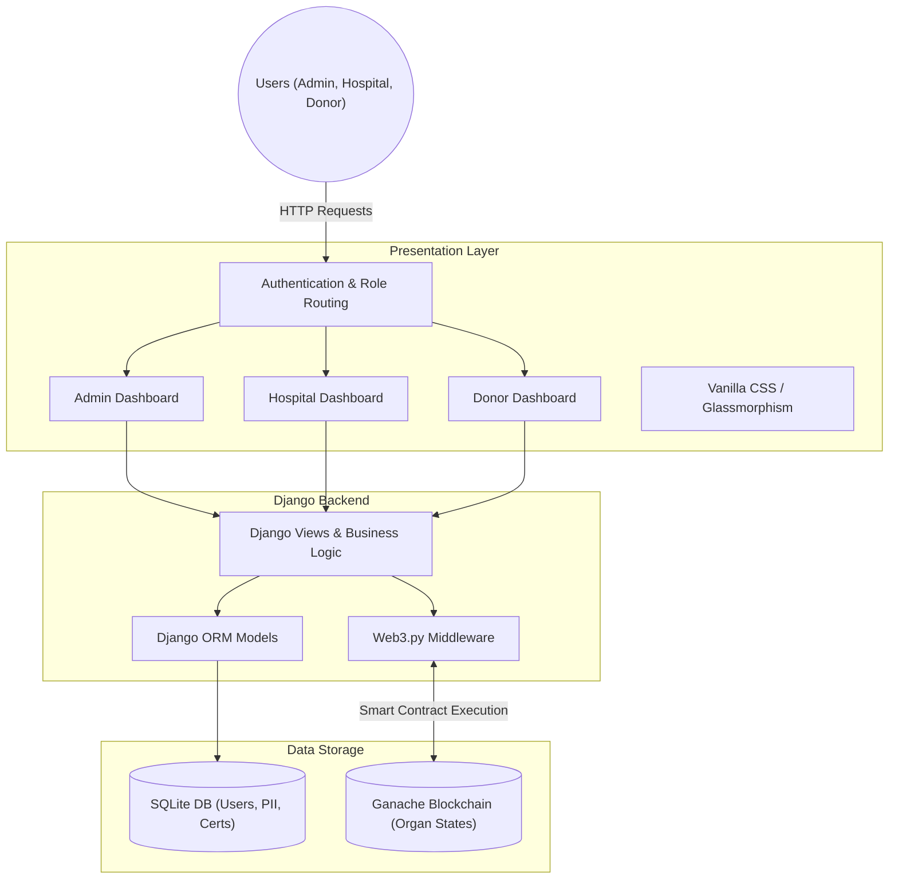

# OrganChain Project Context for Agents

This document provides a high-level architectural overview and technical guidelines for any AI agents interacting with this repository in the future. It is stored in the workspace customizations root (`.agents/AGENTS.md`) to be automatically loaded into the agent's context.

## 🏗️ System Architecture Graph

## 🛠️ Key Technical Rules for Agents
When working in this repository, agents must adhere to the following guidelines:

1. **Frontend Styling & UI:** 
   - The UI uses premium Glassmorphism aesthetics, responsive layouts, and dark mode features built with Vanilla CSS and Bootstrap 5.
   - **Crucial Rule:** The dashboards use a native scrolling layout inherited from `base.html`. Do not apply `overflow: hidden` to the main `body` or use fixed shell layouts that break the main browser scrollbar. 
2. **Blockchain Integration (Ganache):**
   - The project relies on a local Ganache network running on `127.0.0.1:7545` and smart contracts compiled via Truffle.
   - **Privacy Rule:** Never store PII (Personal Identifiable Information) on the blockchain. The blockchain only stores organ states, timestamps, and hashes. Sensitive data lives purely in SQLite.
3. **Database (SQLite):**
   - Always use the Django ORM to access and modify data to prevent SQL injection vulnerabilities.
4. **Authentication & Roles:**
   - Role-based routing is strictly enforced. If implementing new views, always include role validation checks to ensure Donors cannot access Hospital views, and Hospitals cannot access Admin views.
