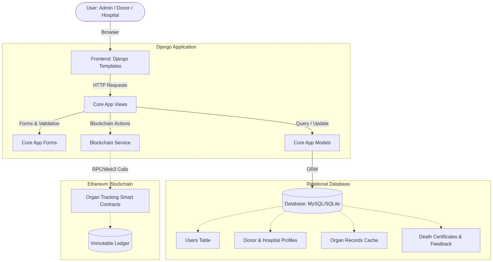
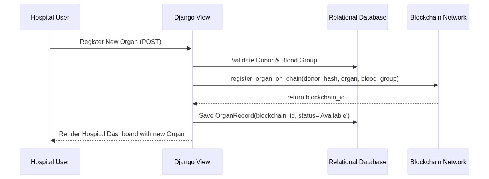

# Repository Architecture: Organ Donation Tracker

I have created an architecture graph and folder structure diagram for the Organ Donation project. 
It contains:
- **System Architecture Diagram**: Shows the relationship between the Django application, Relational Database (MySQL/SQLite), and the Ethereum Blockchain (via the Blockchain Service).
- **Application Data Flow**: Demonstrates how an organ matching or registration flows across different systems.
- **Directory Structure**: A file-tree visualizing your `backend`, `database`, and `frontend` separation.

---

## System Architecture Diagram



## Application Data Flow



## Directory Structure

```text
organ_donation/
├── backend/
│   ├── contracts/            # Smart contracts (Solidity)
│   ├── core/                 # Main Django App
│   │   ├── blockchain/       # Blockchain integration logic
│   │   ├── migrations/       # Database migrations
│   │   ├── admin.py
│   │   ├── forms.py          # Form definitions for auth & data entry
│   │   ├── models.py         # DB schema (User, DonorProfile, etc.)
│   │   ├── urls.py           # App routing
│   │   └── views.py          # View logic (dashboards, auth, actions)
│   ├── media/                # Uploaded files (profile pics)
│   ├── organ_donation_project/ # Django project settings & configuration
│   ├── scripts/              # Helper scripts
│   ├── manage.py
│   ├── requirements.txt
│   └── seed_hospitals.py     # Database seeding scripts
├── database/
│   ├── schema.sql            # Database schema definitions
│   ├── organ_donation_db_full.sql # Full DB dump
│   └── database_records.json # Sample/seed data
├── frontend/
│   ├── static/               # CSS, JS, and Images
│   │   └── core/
│   └── templates/            # HTML Templates
│       └── core/
│           ├── admin_dashboard.html
│           ├── donor_dashboard.html
│           ├── hospital_dashboard.html
│           ├── base.html
│           └── ... (other pages)
└── README.md                 # Project documentation
```
