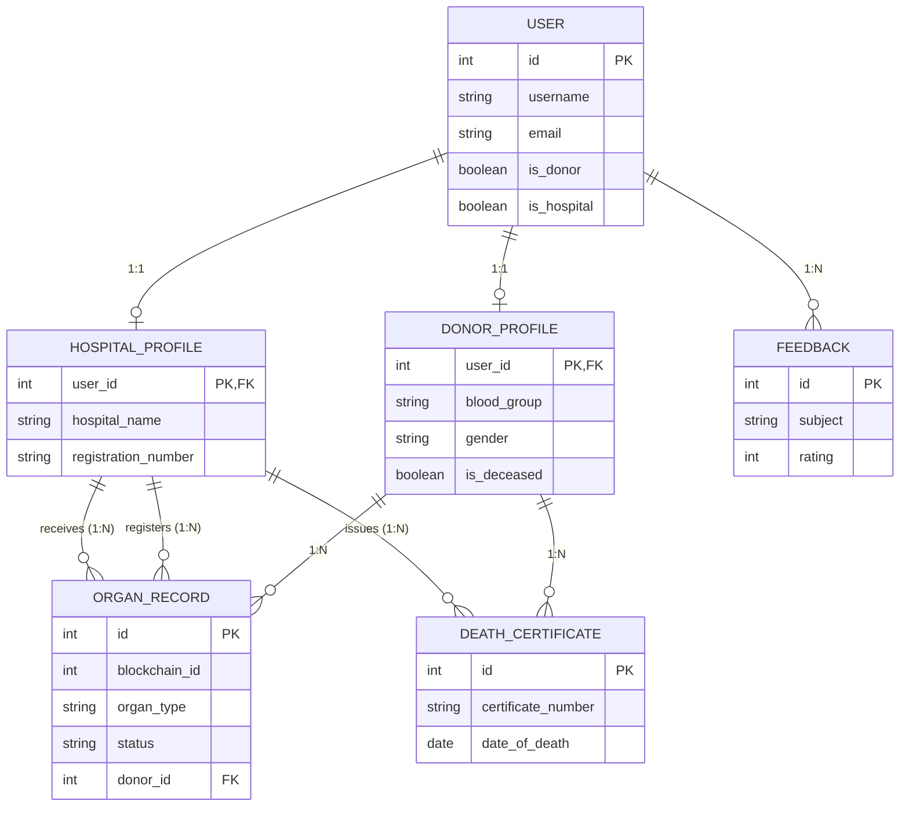

# Database Schema Documentation

This folder contains the database schema for the **Organ Donation Tracking System** project. 
The schema uses MySQL as the backend.

## Schema File
- `schema.sql`: Contains the raw Data Definition Language (DDL) queries used to create the tables, relationships, and constraints in the MySQL database.

## Entity-Relationship (ER) Diagram
Below is an overview of the core entities and their relationships.

